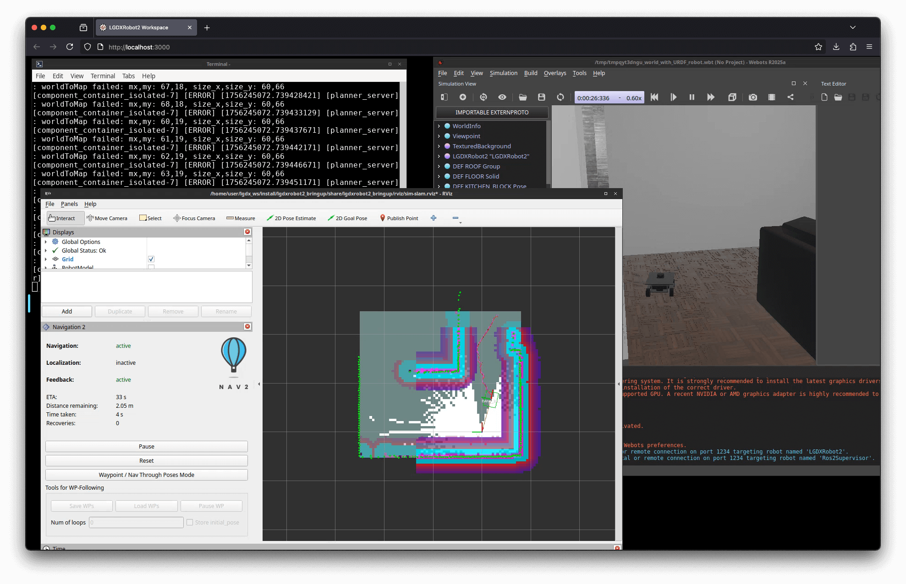
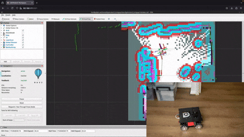
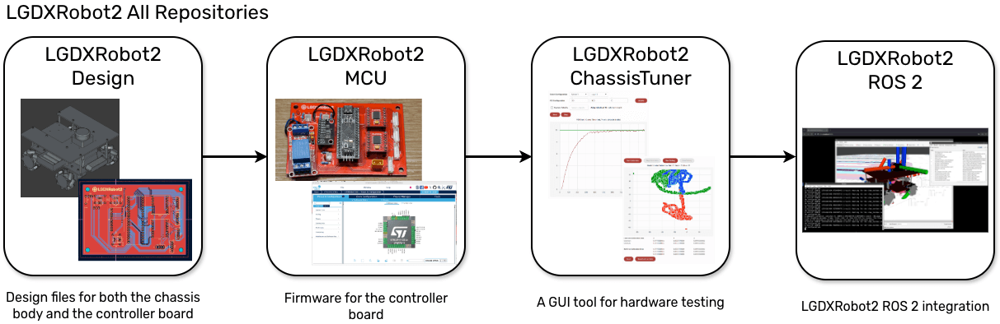

# LGDXRobot2 ROS 2

## Overview

|  |  |
| ---------------- | ----------------- |
|  |  |

> LGDXRobot2 fully uses GitLab CI/CD for builds.<br /> [](https://gitlab.com/lgdxrobotics/lgdxrobot2-ros2/-/releases) 

LGDXRobot2 ROS 2 is an integration software for the LGDXRobot2 utilising ROS 2 ecosystem, especially navigation with the NAV2 stack. It provides examples for both physical robots and simulations. Also, it offers Docker images with ready-to-use ROS 2 environment on a web interface.

The project currently supports ROS 2 Jazzy on Ubuntu 24.04 and offers seamless integration with the [LGDXRobot Cloud](https://gitlab.com/yukaitung/lgdxrobot2-cloud).



* LGDXRobot2 Design: ([GitLab](https://gitlab.com/lgdxrobotics/lgdxrobot2-design) | [GitHub](https://github.com/yukaitung/lgdxrobot2-design))
* LGDXRobot2 MCU: ([GitLab](https://gitlab.com/lgdxrobotics/lgdxrobot2-mcu) | [GitHub](https://github.com/yukaitung/lgdxrobot2-mcu))
* LGDXRobot2 ChassisTuner: ([GitLab](https://gitlab.com/lgdxrobotics/lgdxrobot2-chassistuner) | [GitHub](https://github.com/yukaitung/lgdxrobot2-chassistuner))
* LGDXRobot2 ROS 2: ([GitLab](https://gitlab.com/lgdxrobotics/lgdxrobot2-ros2) | [GitHub](https://github.com/yukaitung/lgdxrobot2-ros2))

### Getting Help

* [Homepage](https://lgdxrobot.bristolgram.uk/lgdxrobot2/)
* [Documentation](https://docs.lgdxrobot.bristolgram.uk/lgdxrobot2/)
* Issue boards on both GitLab and GitHub

## Packages

The solution consists of the following packages:

* `lgdxrobot2_agent`: A ROS agent node for integration with LGDXRobot2 hardware and LGDXRobot Cloud.
* `lgdxrobot2_bringup`: Bringup launch files for LGDXRobot2 hardware.
* `lgdxrobot2_description`: A description package for visualising LGDXRobot2 hardware as a 3D model.
* `lgdxrobot2_msgs`: Interface for LGDXRobot2 ROS 2.
* `lgdxrobot2_navigation`: LGDXRobot2 Nav2 stack integration.
* `lgdxrobot2_webots`: Simulation configuration and driver for Webots.

## Installation

### 1. APT

1. Install [ROS 2 Jazzy](https://docs.ros.org/en/jazzy/Installation/Ubuntu-Install-Debs.html)
2. The packages are hosted in a self-hosted repository, install this package to add the repository and the public key.

```bash
wget -q https://ros.bristolgram.uk/lgdxrobot2-apt-source.deb
sudo dpkg -i lgdxrobot2-apt-source.deb
sudo apt update
```

3. Install the packages. This will also install the required dependencies, including the Nav2 stack.

```bash
sudo apt install lgdxrobot2-udev \
  ros-${ROS_DISTRO}-sllidar-ros2 \
  ros-${ROS_DISTRO}-lgdxrobot2* \
  ros-${ROS_DISTRO}-explore-lite \
  ros-${ROS_DISTRO}-multirobot-map-merge
```

### 2. deb Packages

If adding the repository is not possible, the packages can be installed using the .deb packages.

1. Install [ROS 2 Jazzy](https://docs.ros.org/en/jazzy/Installation/Ubuntu-Install-Debs.html)
2. Download following packages from the [Releases](https://gitlab.com/lgdxrobotics/lgdxrobot2-ros2/-/releases) page.

* `SLAMTEC LIDAR ROS 2`
* `M-EXPLORE ROS 2`
* `LGDXRobot2 ROS 2`
* `LGDXRobot2 UDEV (Universal)`

3. Install the packages and dependencies.

```bash
sudo apt install ./*.deb
```

### 3. Docker

```bash
docker run -d \
  --name lgdxrobot2 \
  -e PUID=1000 \
  -e PGID=1000 \
  -p 3000:3000 \
  -p 3001:3001 \
  yukaitung/lgdxrobot2-desktop:latest
```

Visit [http://localhost:3000](http://localhost:3000) to access the web interface. If the terminal is closed, you can right-click the desktop to relaunch it from the menu.

More information on Docker: [https://docs.lgdxrobot.bristolgram.uk/lgdxrobot2/ros2/installation-docker/](https://docs.lgdxrobot.bristolgram.uk/lgdxrobot2/ros2/installation-docker/)

## How to use LGDXRobot2 ROS 2

[https://docs.lgdxrobot.bristolgram.uk/lgdxrobot2/ros2/bringup-bringup/](https://docs.lgdxrobot.bristolgram.uk/lgdxrobot2/ros2/bringup-bringup/)

## Build from Source

This tutorial assumes that Ubuntu 24.04 LTS has already been installed.

### 1. Prerequisites

1. Install [ROS 2 Jazzy](https://docs.ros.org/en/jazzy/Installation/Ubuntu-Install-Debs.html) ensure that the development tools are installed.
2. Install Packages for LiDAR:

```bash
mkdir -p ~/ros2_ws/src
cd ~/ros2_ws/src
git clone https://github.com/Slamtec/sllidar_ros2.git
cd ..
colcon build --symlink-install
source src/rpldiar_ros2/scripts/create_udev_rules.sh
```

### 2. Build

Clone the project and run the following commands:

```bash
mkdir -p ~/lgdx_ws/src
cd ~/lgdx_ws/src
git clone --recurse-submodules https://gitlab.com/lgdxrobotics/lgdxrobot2-ros2
cd ..

# Install build dependencies
rosdep update
rosdep install --from-paths src --ignore-src -y

# Ensure that lgdxrobot2_msgs is in the system
colcon build --packages-select lgdxrobot2_msgs  --symlink-install
source install/setup.bash

colcon build --symlink-install
```

### 3. Configuration

First, add the user to the `dialout` group to allow access to the controller board.

```bash
sudo usermod -a -G dialout $USER
```

Then, source the setup files for the ROS 2 workspaces. You can optionally ignore the Webots workspace.

```bash
source ~/lgdx_ws/install/setup.bash
source ~/ros2_ws/install/setup.bash
```

## License

This project is licensed under the MIT Licence.

## Extra Dependencies

* [hwinfo](https://github.com/lfreist/hwinfo)
* [sllidar_ros2](https://github.com/Slamtec/sllidar_ros2)
* [m-explore-ros2](https://github.com/robo-friends/m-explore-ros2)

## Credits

* [Docker images for Selkies](https://github.com/linuxserver/docker-baseimage-selkies/)

## Acknowledgements

### ROS 2

> S. Macenski, T. Foote, B. Gerkey, C. Lalancette, W. Woodall, “[Robot Operating System 2: Design, architecture, and uses in the wild](https://www.science.org/doi/10.1126/scirobotics.abm6074).”, Science Robotics vol. 7, May 2022.

> S. Macenski, A. Soragna, M. Carroll, Z. Ge, “[Impact of ROS 2 Node Composition in Robotic Systems](https://arxiv.org/abs/2305.09933)”, IEEE Robotics and Autonomous Letters (RA-L), 2023.

### NAV2

> S. Macenski, F. Martín, R. White, J. Clavero. [The Marathon 2: A Navigation System](https://arxiv.org/abs/2003.00368). IEEE/RSJ International Conference on Intelligent Robots and Systems (IROS), 2020.

> S. Macenski, T. Moore, DV Lu, A. Merzlyakov, M. Ferguson, [From the desks of ROS maintainers: A survey of modern & capable mobile robotics algorithms in the robot operating system 2](https://arxiv.org/pdf/2307.15236), Robotics and Autonomous Systems, 2023

> S. Macenski, M. Booker, J. Wallace, Open-Source, [Cost-Aware Kinematically Feasible Planning for Mobile and Surface Robotics](https://arxiv.org/abs/2401.13078),

### Selkies

> Kim, S., Isla, D., Hejtmánek, L., et al., Selkies-GStreamer, (2024), GitHub repository, https://github.com/selkies-project/selkies-gstreamer

This project has been developed and is supported in part by the National Research Platform (NRP) and the Cognitive Hardware and Software Ecosystem Community Infrastructure (CHASE-CI) at the University of California, San Diego, by funding from the National Science Foundation (NSF), with awards #1730158, #1540112, #1541349, #1826967, #2138811, #2112167, #2100237, and #2120019, as well as additional funding from community partners, infrastructure utilization from the Open Science Grid Consortium, supported by the National Science Foundation (NSF) awards #1836650 and #2030508, and infrastructure utilization from the Chameleon testbed, supported by the National Science Foundation (NSF) awards #1419152, #1743354, and #2027170. This project has also been funded by the Seok-San Yonsei Medical Scientist Training Program (MSTP) Song Yong-Sang Scholarship, College of Medicine, Yonsei University, the MD-PhD/Medical Scientist Training Program (MSTP) through the Korea Health Industry Development Institute (KHIDI), funded by the Ministry of Health & Welfare, Republic of Korea, and the Student Research Bursary of Song-dang Institute for Cancer Research, College of Medicine, Yonsei University.